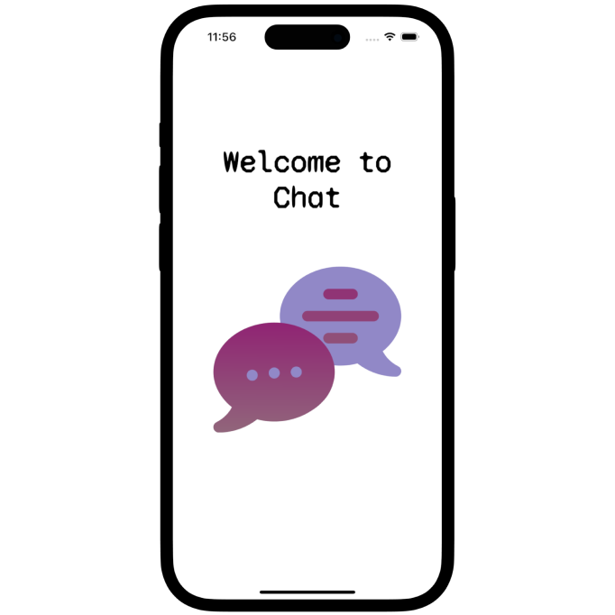
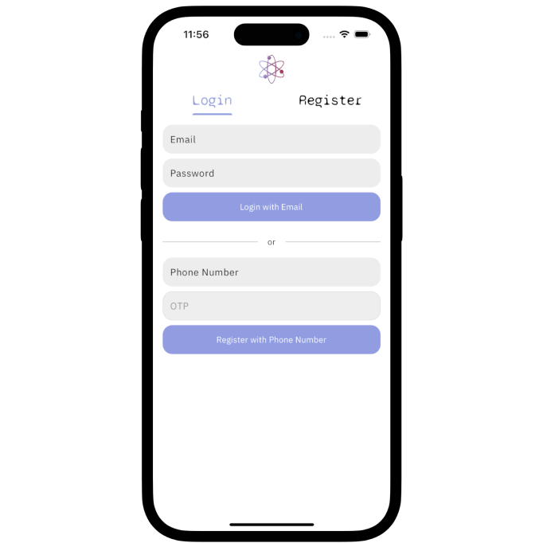
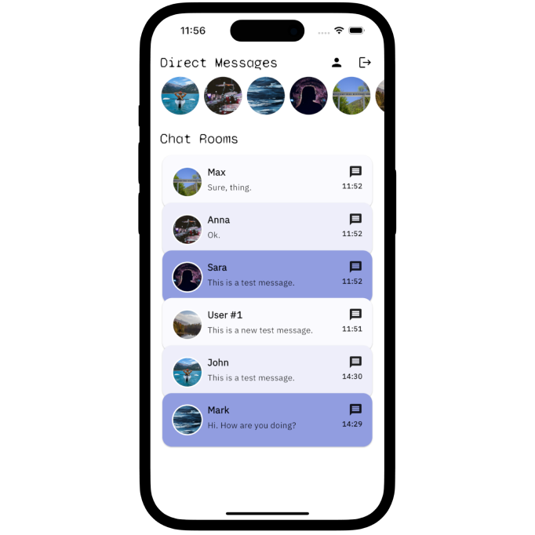
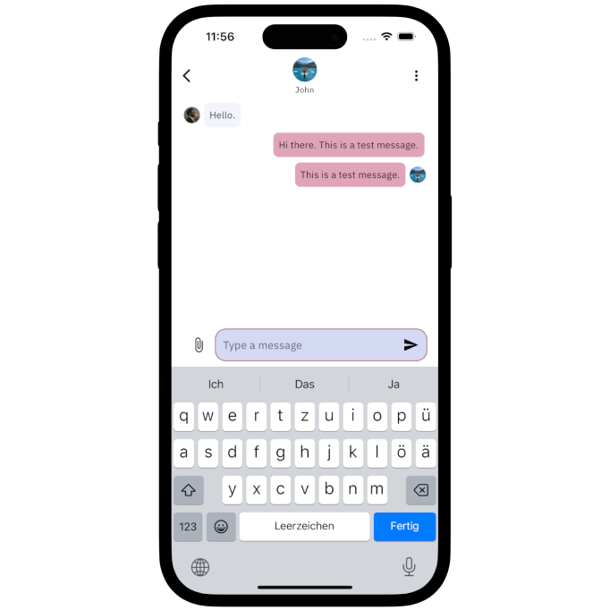

# Chat App with Flutter, Dart Frog and WebSockets

Welcome to the Chat App with Flutter, Dart Frog and WebSocket project! This project aims to fully-functioning full-stack chat application with Flutter and Dart. The app uses a Dart Frog server, with a REST API and a WebSocket setup to handle the communication between the client and the database. 

- YouTube tutorial: https://youtu.be/by44X7SwYx0

If you're looking for a more complete Chat App template:
- EchoLink: A Chat app template: https://www.atomsbox.com/templates/echo-link

## Features
1. **Splash Screen**: First page of the application with a smooth animation (from lottie)
2. **Login Screen**: Login and register feature with Supabase Auth. It uses two auth provider: email & password and phone with OTP.
3. **Chat Room List Screen**: Central hub to see all the contacts and the chat room available for the currently logged in user.
4. **Chat Room Screen**: Displays all the messages in a chat room and enables the user to send more messages. 


## App Screenshots: 
| |  |  |
|:---:|:---:|:---:|
| Splash Screen  | Login Screen | Chat Room List Screen |
|  |  |  |
| Chat Room Screen | | |


## Getting Started

To get started with the project, ensure you have Dart, Flutter and the dart_frog CLI set up on your local machine.

1. **Navigate to Project Directory**:
    ```bash
    cd <project name>
    ```

2. **Install Dependencies**:
    ```bash
    flutter pub get
    ```

3. **Start the Dart Frog server locally**:
    ```bash
    cd <project name>/api
    # Install the dart_frog cli from pub.dev
    dart pub global activate dart_frog_cli
    # Start the server on localhost
    dart_frog dev
    ```

4. **Run the App**:
    ```bash
    flutter run
    ```


